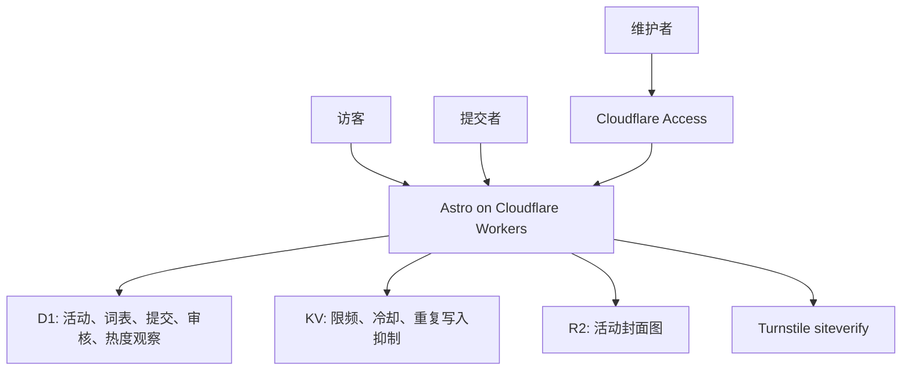
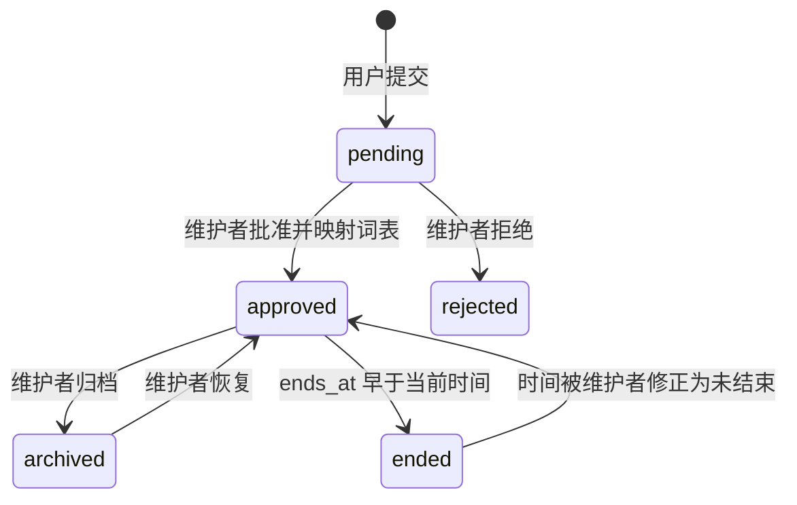
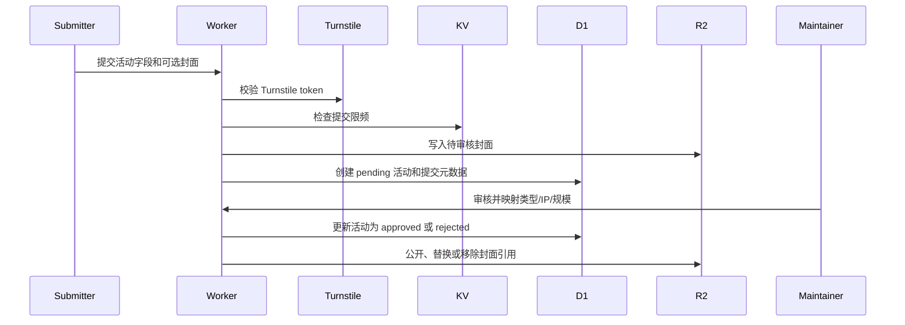

# feat: Build ACG events directory

## Summary

实现中国 ACG 活动半可信目录首版：访客可以筛选近期活动、查看详情并前往官方渠道，提交者可以免注册提交活动，维护者可以审核、规范词表并管理公开记录。计划覆盖完整首版，但实施顺序先让发现闭环可独立验证，再接入提交、后台、封面图和热度。

---

## Problem Frame

`docs/brainstorms/2026-06-08-acg-events-directory-requirements.md` 把产品定位为公益、轻量、半可信活动目录。当前仓库仍是 Astro + Cloudflare 的最小骨架，只有欢迎页、基础布局、Tailwind 引入和 Wrangler 配置；因此实现需要先建立可测试的 Cloudflare 数据和服务端领域层，再替换公开页面并补齐提交、审核、图片和热度流程。

---

## Requirements

**公开发现与详情**

- R1. 公开浏览必须支持按地点、时间、活动类型、活动 IP 和活动规模筛选，并默认聚焦未结束、已批准活动。
- R2. 普通列表必须按维护者管理的规模优先排序，并保留可分享或可恢复的筛选状态。
- R3. 活动卡片和详情页必须展示发现所需字段，包括名称、地点、日期范围、类型、活动 IP、规模、封面图可用状态，以及详情入口。
- R4. 已结束活动的详情页必须保留直达访问，但不得出现在默认近期列表或首页热门榜。
- R5. 详情页必须在官方 QQ 群或购票地址存在时提供清晰的官方渠道入口。

**提交与审核**

- R6. 提交者必须能免注册提交活动，必填活动名称、地点、开始时间、结束时间、活动类型文本和活动 IP 文本。
- R7. 官方 QQ 群、购票地址、提交者联系方式和一张封面图必须可选，且提交成功后只提示等待审核。
- R8. 未批准提交、封面图、联系方式和内部审核信息不得进入公开发现路径。
- R9. 维护者必须能审核、编辑、批准、拒绝、归档活动，并管理全部活动记录和历史记录。
- R10. 维护者必须能管理活动规模标签、活动类型词表、活动 IP 词表，并在审核时把提交字符串映射到正式词条。
- R11. 维护者必须能审核、替换或移除活动封面图。

**热度、信任与运维**

- R12. 详情页访问必须产生热度值，同一访客 IP 在同一活动的同一统计窗口内只计一次。
- R13. 首页必须展示未结束活动的近 3 日、7 日、30 日热门榜，并排除待审核、拒绝、归档和已结束活动。
- R14. 系统不得向公开访客暴露未批准提交、拒绝记录、内部审核备注、提交者联系方式或明文访客 IP。
- R15. 提交入口必须具备基础反滥用保护，热度计数必须在不存储明文访客 IP 的前提下完成。
- R16. 本地开发、测试、部署文档必须覆盖 D1、KV、R2、Turnstile、Access 和类型生成，让后续维护者能重复搭建环境。

---

## Key Technical Decisions

- KTD1. **D1 作为事实来源：** 活动状态、词表、审核轨迹、提交队列、封面元数据和热度观察都需要一致查询和约束，D1 比 KV 更适合作为权威存储。
- KTD2. **KV 只做短期运行态键：** KV 用于提交限频、冷却和可选重复写入抑制，不作为热度或活动状态的权威来源。
- KTD3. **R2 使用 Worker 绑定直写：** 封面图上传经 Worker 验证后写入 R2，沿用 SeatView 的 Cloudflare-only 思路，避免浏览器持有可写对象存储凭据。
- KTD4. **提交与公开记录共享活动实体：** 提交先以待审核状态进入活动记录和提交元数据，批准后同一活动记录转为公开，避免审核后复制出第二套数据。
- KTD5. **词表在审核时规范化：** 提交阶段保留用户输入字符串，公开查询只依赖维护者映射后的正式类型、活动 IP 和规模标签。
- KTD6. **热度以 D1 唯一观察记录保证正确性：** 对活动、访客哈希和日期粒度建立唯一约束，再按 3/7/30 日窗口统计独立访问，KV 只能减少重复写入压力。
- KTD7. **访客 IP 先哈希再存储：** 所有限频和热度逻辑只使用带密钥盐的哈希值；明文 IP 不写入 D1、KV、日志或后台界面。
- KTD8. **后台以 Cloudflare Access 为生产边界：** 生产后台依赖 Access JWT 校验和维护者邮箱身份，本地只允许受环境限制的 mock 管理员身份。
- KTD9. **服务端领域逻辑优先测试：** 当前没有测试骨架，首个实施单元必须建立 Vitest、Cloudflare binding 替身和领域 fixture，后续单元围绕服务端规则补测试，再补关键浏览器冒烟。
- KTD10. **前端采用操作型目录界面：** 网站不是营销页；首页直接呈现筛选、热门榜和活动列表，后台采用密集、可扫描的管理界面。

---

## High-Level Technical Design



活动生命周期：



提交到公开的规范化流程：



---

## Output Structure

```text
src/
  components/
    admin/
    events/
  lib/
  pages/
    admin/
    api/
    events/
  server/
    admin/
    db/
    events/
    submissions/
    security/
tests/
  e2e/
  fixtures/
  server/
migrations/
docs/
  brainstorms/
  plans/
```

---

## Implementation Units

### U1. Cloudflare bindings, schema, and test foundation

- **Goal:** 建立 D1/KV/R2/Turnstile/Access 可测试基础，以及活动目录首版需要的数据库模型和 fixture。
- **Requirements:** R6, R8, R9, R10, R11, R12, R14, R15, R16；支持 F2、F3、F4。
- **Dependencies:** none
- **Files:** `package.json`, `pnpm-lock.yaml`, `wrangler.jsonc`, `worker-configuration.d.ts`, `src/env.d.ts`, `drizzle.config.ts`, `migrations/*`, `src/server/db/schema.ts`, `src/server/db/client.ts`, `src/server/db/test-utils.ts`, `tests/setup/*`, `tests/fixtures/events.ts`
- **Approach:** 添加 Vitest 和必要的测试环境；用 Drizzle 定义活动、提交、词表、规模标签、审核记录、封面元数据和访问观察表；Wrangler 配置增加 D1、KV、R2 bindings 和必要 vars。D1 migrations 使用 `migrations/` 默认目录，并保留应用到本地和远程 D1 的路径。
- **Execution note:** 先写 schema/fixture 测试，确保状态、可见性和热度唯一约束在后续业务代码前锁住。
- **Patterns to follow:** 保留现有 `@astrojs/cloudflare` adapter、Tailwind v4 Vite plugin 和 `wrangler.jsonc` JSONC 风格；参考 SeatView README 的 `DB`、`RATE_LIMIT`、`BUCKET` 绑定分工。
- **Test scenarios:**
  - 验证活动状态包含 pending、approved、rejected、archived，公开查询相关字段有索引支持。
  - 验证规模标签、活动类型、活动 IP 是运行时数据，且支持停用和排序字段。
  - 验证热度观察对活动、IP 哈希和日期的唯一性约束能阻止同日重复贡献。
  - 验证测试环境缺少 DB/KV/R2 binding 时返回明确错误，而不是静默使用 undefined。
  - 验证 fixture 覆盖已批准、待审核、已拒绝、已归档、已结束、有封面和无封面的活动。
- **Verification:** `pnpm test` 能运行新测试；`pnpm cf-typegen` 后绑定类型包含 DB、RATE_LIMIT、BUCKET 和配置 vars；`pnpm lint` 仍通过。

### U2. Shared domain services and validation

- **Goal:** 抽出服务端领域层，让公开查询、提交、后台和热度都复用同一套可见性、验证和词表规则。
- **Requirements:** R1, R2, R3, R6, R8, R10, R14, R15；支持 F1、F2、F3。
- **Dependencies:** U1
- **Files:** `src/server/events/queries.ts`, `src/server/events/validation.ts`, `src/server/events/visibility.ts`, `src/server/events/vocabularies.ts`, `src/server/security/ip-hash.ts`, `src/lib/event-filters.ts`, `tests/server/events/*.test.ts`, `tests/server/security/ip-hash.test.ts`
- **Approach:** 定义 filter DTO、提交校验、公开可见性谓词、后台可见性谓词、词表映射服务和 IP 哈希工具。公开查询统一要求 approved，默认未结束；详情查询允许 approved 且已结束的活动直达访问。
- **Execution note:** 先用 fixture 驱动查询测试，再接页面。
- **Patterns to follow:** 使用 TypeScript 模块边界隔离 `src/server/*` 和 `src/lib/*`；客户端只导入无 binding 依赖的筛选序列化工具。
- **Test scenarios:**
  - Covers AE1. 给定上海和广州活动，按上海筛选只返回已批准且未结束的上海活动。
  - Covers AE2. 给定不同规模排序权重，普通列表先按规模优先级排序。
  - 验证待审核、已拒绝、已归档活动不会进入公开列表。
  - 验证已结束活动不会进入默认列表，但详情可见性允许直达。
  - 验证无效日期范围、缺少必填字段、无效 QQ 群号和不支持 URL 会被提交校验拒绝。
  - 验证 IP 哈希在相同密钥下稳定，在不同密钥下不同，且不会返回明文 IP。
- **Verification:** 服务端测试覆盖筛选、排序、校验、可见性和 IP 哈希；实现者能用领域服务构建页面而不重复 SQL 条件。

### U3. Public discovery homepage and event detail pages

- **Goal:** 用真实目录体验替换 Astro 欢迎页，让访客完成发现闭环。
- **Requirements:** R1, R2, R3, R4, R5；支持 F1。
- **Dependencies:** U1, U2
- **Files:** `src/layouts/Layout.astro`, `src/pages/index.astro`, `src/pages/events/[slug].astro`, `src/components/events/EventFilters.tsx`, `src/components/events/EventCard.astro`, `src/components/events/EventDetail.astro`, `src/components/events/OfficialLinks.astro`, `src/styles/global.css`, `tests/server/events/public-query.test.ts`, `tests/e2e/discover-events.spec.ts`
- **Approach:** 首页直接呈现筛选控件、活动列表和热门榜占位接入点；筛选状态写入 URL 查询参数；活动卡片保持紧凑扫描；详情页展示官方 QQ 群、购票地址和封面。没有封面时使用稳定占位视觉，不阻塞活动展示。
- **Patterns to follow:** Astro 页面做 SSR，交互筛选使用 React island；布局从现有 `Layout.astro` 扩展为中文站点基础布局。
- **Test scenarios:**
  - Covers AE1. 浏览器按地点筛选后列表只显示匹配的已批准近期活动，URL 保留筛选状态。
  - Covers AE3. 详情页展示官方 QQ 群和购票地址，并提供可点击或可复制入口。
  - Covers AE4. 已结束活动不出现在首页列表，但直达详情页仍可访问。
  - 验证空结果显示“没有匹配近期活动”语义，不显示全站无数据措辞。
  - 验证移动端活动卡片中的长活动名、长场馆名和长 IP 名不会撑破布局。
- **Verification:** 首页和详情页不再显示 Astro welcome；访客可以从筛选列表进入详情，并看到官方渠道。

### U4. Anonymous submission with Turnstile, rate limiting, and cover upload

- **Goal:** 建立免注册提交流程，支持必填活动字段、可选联系方式、可选单张封面图和反滥用保护。
- **Requirements:** R6, R7, R8, R15；支持 F2。
- **Dependencies:** U1, U2
- **Files:** `src/pages/submit.astro`, `src/pages/api/submissions/index.ts`, `src/server/submissions/create.ts`, `src/server/submissions/cover-upload.ts`, `src/server/security/turnstile.ts`, `src/server/security/rate-limit.ts`, `src/components/events/EventSubmissionForm.tsx`, `.dev.vars.example`, `tests/server/submissions/*.test.ts`, `tests/server/security/turnstile.test.ts`, `tests/server/security/rate-limit.test.ts`, `tests/e2e/submit-event.spec.ts`
- **Approach:** 客户端表单提交 token 和字段到 Worker；Worker 服务端调用 Turnstile siteverify，检查 IP 哈希限频，再写入 pending 活动和可选 R2 封面。Turnstile token 单次、短有效期的事实要求失败时提示重新验证，不复用旧 token。
- **Patterns to follow:** 借鉴 SeatView 的“免注册 + Turnstile + IP 限频 + R2 绑定直写”模式，但本产品只上传单张活动封面。
- **Test scenarios:**
  - Covers AE5. 只提交必填字段且省略联系方式和封面时提交成功，并进入待审核状态。
  - 验证缺失必填字段、结束时间早于开始时间、无效购票 URL、无效 QQ 群号返回字段级错误。
  - 验证 Turnstile token 缺失、失败、超时和成功路径。
  - 验证同一 IP 哈希触发冷却或每日上限后提交被拒绝，且不泄露明文 IP。
  - 验证封面图可选；提供封面时对象写入 R2，活动批准前公开页不可见。
- **Verification:** 匿名提交页面可完成待审核提交；待审核活动不会出现在公开列表、详情或热门榜。

### U5. Maintainer access, review queue, and full admin management

- **Goal:** 建立生产由 Cloudflare Access 保护的维护后台，覆盖审核、活动管理、词表管理、规模标签和封面管理。
- **Requirements:** R8, R9, R10, R11, R14；支持 F3。
- **Dependencies:** U1, U2, U4
- **Files:** `src/middleware.ts`, `src/server/admin/auth.ts`, `src/server/admin/events.ts`, `src/server/admin/vocabularies.ts`, `src/server/admin/covers.ts`, `src/pages/admin/index.astro`, `src/pages/admin/events/[id].astro`, `src/pages/admin/vocabularies.astro`, `src/pages/admin/scales.astro`, `src/pages/api/admin/events/[id].ts`, `src/pages/api/admin/vocabularies.ts`, `src/components/admin/AdminShell.astro`, `src/components/admin/EventReviewEditor.tsx`, `src/components/admin/VocabularyManager.tsx`, `tests/server/admin/*.test.ts`, `tests/e2e/admin-review.spec.ts`
- **Approach:** `middleware.ts` 和 API handlers 共享管理员身份解析；生产校验 Access JWT 的 audience 和 issuer，本地只在开发环境允许 mock 维护者邮箱。后台提供待审核队列、活动详情编辑、批准/拒绝/归档、规模标签排序、类型/IP 词表增改停用和封面替换/移除。
- **Execution note:** 权限边界先测后做 UI，避免后台 API 可被匿名调用。
- **Patterns to follow:** SeatView README 中 `/admin` 由 Cloudflare Access 保护的边界；Cloudflare Access 文档中的 `cf-access-jwt-assertion` 校验模型。
- **Test scenarios:**
  - Covers AE6. 待审核提交包含新活动 IP 字符串时，维护者能创建或选择正式 IP 词条后批准。
  - Covers AE8. 含联系方式的 pending 提交不会被公开查询看到。
  - 验证匿名请求无法访问 `/admin` 和 `/api/admin/*`。
  - 验证无效 Access JWT、错误 audience、缺失 issuer 被拒绝。
  - 验证本地 mock 管理员身份只在开发/测试模式生效，生产模式不可用。
  - 验证批准、拒绝、归档、恢复、封面替换和词表停用都会写入审核或管理审计记录。
- **Verification:** 维护者能完成“待审核提交 -> 映射词表和规模 -> 批准 -> 公开出现”的闭环；匿名用户无法进入后台。

### U6. Hotness tracking and homepage hot lists

- **Goal:** 实现同 IP 去重详情页访问计数，以及首页 3/7/30 日未结束活动热门榜。
- **Requirements:** R12, R13, R14, R15；支持 F4。
- **Dependencies:** U1, U2, U3
- **Files:** `src/server/events/hotness.ts`, `src/server/events/hotlists.ts`, `src/pages/api/events/[id]/view.ts`, `src/components/events/HotEventsTabs.tsx`, `src/components/events/HotEventList.astro`, `src/pages/events/[slug].astro`, `src/pages/index.astro`, `tests/server/events/hotness.test.ts`, `tests/server/events/hotlists.test.ts`, `tests/e2e/home-hotlists.spec.ts`
- **Approach:** 详情页加载时记录 approved 活动的访问观察，使用 IP 哈希和日期唯一约束去重；可选 KV 冷却键减少同日重复写入。热门榜只查 approved 且未结束活动，按窗口内独立访问数排序，再用开始时间和活动 ID 做稳定平局排序。
- **Patterns to follow:** D1 做事实来源，KV 做短期抑制；不要把热门榜统计变成商业 analytics 表面。
- **Test scenarios:**
  - Covers AE4. 已结束活动即使有访问也不会进入热门榜。
  - Covers AE7. 同一 IP 在窗口内多次访问同一详情页只贡献一次计数。
  - 验证不同 IP 哈希访问同一活动会分别计数。
  - 验证 pending、rejected、archived 活动不会记录公开热度，也不会进入热门榜。
  - 验证 3/7/30 日窗口边界和稳定平局排序。
  - 验证没有访问数据时热门榜显示空状态或即将开始备用内容，且不误称为错误。
- **Verification:** 首页能切换 3/7/30 热门榜；重复请求不会抬高同一 IP 的窗口计数。

### U7. Visual design, accessibility, and responsive polish

- **Goal:** 让公开目录和维护后台达到可用、可扫描、移动端不崩的首版体验。
- **Requirements:** R1, R2, R3, R4, R5, R9, R16；支持 F1、F3、F4。
- **Dependencies:** U3, U4, U5, U6
- **Files:** `src/styles/global.css`, `src/layouts/Layout.astro`, `src/components/events/*.astro`, `src/components/events/*.tsx`, `src/components/admin/*.astro`, `src/components/admin/*.tsx`, `tests/e2e/discover-events.spec.ts`, `tests/e2e/admin-review.spec.ts`
- **Approach:** 公开站点采用目录型首页，不做营销 hero；筛选和榜单优先扫描效率。后台采用工作台布局，支持待审核、已发布、词表和规模标签之间快速切换。所有按钮、表单和链接保留键盘可达性、可见焦点和明确状态。
- **Patterns to follow:** Tailwind v4 token 写在 `src/styles/global.css`；使用现有 Astro/React 组合；避免一色系和装饰性卡片堆叠。
- **Test scenarios:**
  - 验证移动视口下筛选控件、活动卡片、热门榜和详情页官方渠道不重叠。
  - 验证后台列表在长标题、长活动 IP、长地点下仍可扫描。
  - 验证表单错误信息关联到对应字段，键盘可以完成提交与后台审核。
  - 验证有封面和无封面活动的卡片尺寸稳定。
- **Verification:** 浏览器级截图检查桌面和移动端首页、详情页、提交页、后台审核页；无明显文本溢出或控件重叠。

### U8. Documentation, seed data, and operational readiness

- **Goal:** 补齐开发、预览、部署、迁移、Access、Turnstile 和种子数据文档，让项目能被重复运行。
- **Requirements:** R16；支持全部流程的开发和验收。
- **Dependencies:** U1, U3, U4, U5, U6
- **Files:** `README.md`, `.dev.vars.example`, `scripts/seed-events.ts`, `tests/fixtures/events.ts`, `docs/plans/2026-06-08-001-feat-acg-events-directory-plan.md`
- **Approach:** README 保留现有跑活清单，并补充本地 D1 migrations、Cloudflare binding 类型生成、Turnstile 测试 key、R2 本地预览、Access 生产配置和 demo seed。种子数据覆盖多城市、多规模、多状态、多热度窗口。
- **Patterns to follow:** SeatView README 的运维说明层次：快速开始、部署、绑定、后台保护、关键取舍。
- **Test scenarios:**
  - 验证 seed 生成的数据能支持首页、筛选、详情、提交和后台冒烟。
  - 验证 README 中提到的脚本名都存在于 `package.json`。
  - 验证 `.dev.vars.example` 不包含真实 secret，并清楚区分公开变量和 Worker secrets。
- **Verification:** 新开发者可以按 README 安装依赖、应用本地 migrations、灌入 demo 数据、运行测试并预览站点。

---

## Acceptance Examples

- AE1. 给定上海和广州都有已批准近期活动，当访客按上海筛选时，只显示匹配的已批准近期上海活动。
- AE2. 给定两个匹配近期活动拥有不同规模标签，当访客查看普通列表时，规模标签优先级更高的活动排在前面。
- AE3. 给定一个已批准活动有官方 QQ 群和购票地址，当访客打开详情页时，两个官方渠道都可见且可到达。
- AE4. 给定某活动昨天已经结束，当首页热门榜渲染时，即使该活动详情页仍可通过直达链接访问，它也不会出现在热门榜中。
- AE5. 给定提交者填写必填字段并省略可选联系方式和封面图，当他们提交活动时，提交成功并进入待审核状态。
- AE6. 给定一个待审核提交包含新的活动 IP 字符串，当维护者审核它时，维护者可以先创建或选择正式活动 IP 词条，再批准活动。
- AE7. 给定同一访客 IP 在一个热度窗口内多次打开同一活动详情页，当计算热度时，该访客在该窗口内只贡献一次计数。
- AE8. 给定一个待审核提交包含提交者联系方式，当公开访客搜索目录时，该提交和联系方式都不可见。

---

## Scope Boundaries

### Deferred for later

- 提交者状态页、查询码和自助修改。
- 超出 `STRATEGY.md` 中轻量健康信号的高级分析。
- 面向已结束活动的专门历史浏览页；首版只保留直达详情页可访问。
- 第三方活动抓取、账号系统、收藏、通知和评论。

### Outside this product's identity

- 站内社交功能，例如评论、关注、收藏、私信或社区信息流。
- 独立售票或支付流程；网站只指向官方外部渠道。
- 完全匿名且无需审核、提交后立即公开的发布板。

### Deferred to Follow-Up Work

- Cloudflare Access policy 的生产控制台配置需要部署者在 Cloudflare Zero Trust 中完成；本计划只实现 Worker 侧校验和文档。
- R2 自定义域名、图片变体和 CDN 缓存策略可以在首版可用后单独优化。

---

## System-Wide Impact

- **可见性规则：** 公开列表、详情、热门榜和未来 sitemap/API 都必须以 approved 为公开边界；默认发现和热门榜还必须排除已结束活动。
- **隐私规则：** 访客 IP 只允许以带密钥盐的哈希参与限频和热度，后台也不能展示明文 IP。
- **审核规则：** 用户提交的类型/IP 字符串和封面图在维护者批准前都不是公开数据。
- **Cloudflare binding 规则：** D1、KV、R2、Turnstile secret 和 Access 配置必须在类型、测试替身、README 和部署文档中保持一致。

---

## Risks & Dependencies

| Risk | Mitigation |
| --- | --- |
| 完整后台让首版范围变大 | 按依赖顺序先完成发现闭环，再实现提交和后台；后台 UI 可先支持必要字段和词表管理，再做体验 polish。 |
| 词表规范化拖慢审核 | 审核页把提交字符串、现有词条搜索、新建词条和规模选择放在同一工作流中。 |
| 热度被重复访问刷高 | D1 唯一观察记录保证同一 IP 哈希在窗口内不重复贡献，KV 只做写入抑制。 |
| Turnstile 网络失败影响提交 | 提交接口区分验证失败和临时故障，前端提示重新验证或稍后重试。 |
| Access 只在边缘配置而 Worker 侧缺少校验 | Worker 侧仍验证 Access JWT 的 issuer/audience，并拒绝缺失 token 的后台请求。 |
| R2 封面对象和活动状态不同步 | 封面元数据写入 D1，公开查询只展示 approved 活动关联的可公开封面；替换和移除都写审计记录。 |

---

## Documentation / Operational Notes

- D1 migrations 以 `migrations/` 目录跟踪；计划实现后 README 必须说明本地和远程迁移的区别。
- Wrangler 配置需要声明 `d1_databases`、`kv_namespaces` 和 `r2_buckets`，并在生成类型后同步 `worker-configuration.d.ts`。
- Turnstile secret 必须只在服务端使用；客户端只持有公开 site key。
- 生产后台需要 Cloudflare Access application 和 policy；本地 mock 管理员身份不得在生产启用。
- `PUBLIC_*` 构建期变量和 Worker runtime vars 必须在 README 中区分，避免前端读取不到或把 secret 打进 bundle。

---

## Sources & Research

- `docs/brainstorms/2026-06-08-acg-events-directory-requirements.md` 是本计划的 origin，定义了公开发现、提交、审核、热度、隐私和范围边界。
- `STRATEGY.md` 定义了半可信目录、普通 ACG 爱好者、轻量健康信号和不做站内社交的产品方向。
- `package.json`、`astro.config.mjs`、`wrangler.jsonc`、`src/pages/index.astro` 确认当前仓库是 Astro 6、React islands、Tailwind v4、Drizzle、Wrangler 4 和 Cloudflare Workers 骨架。
- SeatView README 确认可借鉴模式：免注册提交、Cloudflare Turnstile、IP 限频、D1/KV/R2、Access 后台、Worker 绑定直写 R2，以及 Astro 6 使用 Cloudflare Workers 部署。
- Cloudflare Wrangler configuration docs 确认 D1、KV、R2 和 vars 都是 Worker bindings，环境级 bindings 需要显式配置。
- Cloudflare D1 migrations docs 确认 migrations 以 SQL 文件版本化，默认目录是 `migrations/`，D1 binding 可指定 `migrations_dir`。
- Cloudflare Turnstile server validation docs 确认 token 必须服务端调用 siteverify，token 5 分钟有效且单次使用，secret 不得暴露给前端。
- Cloudflare Access JWT docs 确认应用可通过 `cf-access-jwt-assertion` header 验证 JWT，并校验 issuer 和 audience。
