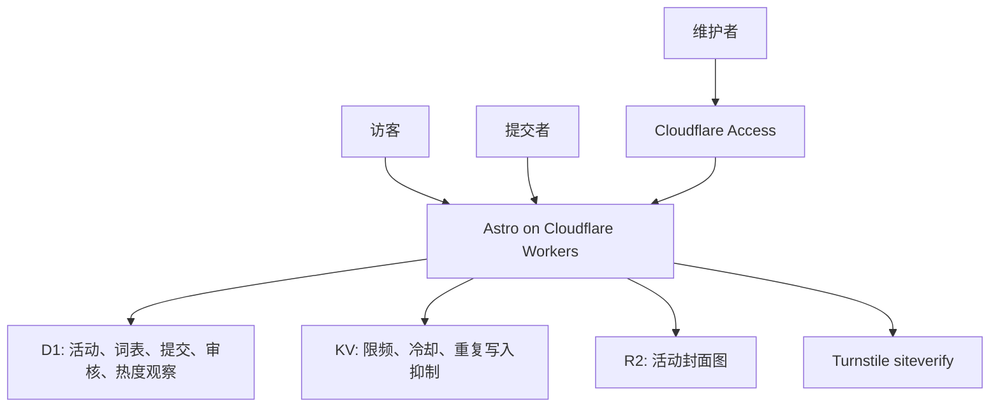

# feat: ACG events directory plan index

## Summary

本文件由原始完整计划拆分而来，作为 ACG 活动目录首版的总览索引。实际执行时请一次选择一个子计划推进，避免单次任务同时覆盖数据基础、公开发现、提交、后台、热度、视觉和运维全部范围。

首版目标不变：实现中国 ACG 活动半可信目录，让访客筛选近期活动、查看详情并前往官方渠道；让提交者免注册提交活动；让维护者审核、规范词表并管理公开记录。

---

## Split Plans

| Order | Plan | Scope | Depends On |
| --- | --- | --- | --- |
| 1 | `docs/plans/2026-06-08-001a-acg-events-foundation-plan.md` | Cloudflare bindings、D1 schema、测试基础、领域服务、筛选/可见性/词表/IP 哈希规则 | none |
| 2 | `docs/plans/2026-06-08-001b-acg-events-public-discovery-plan.md` | 首页发现、筛选、活动卡片、详情页、官方渠道入口 | 001a |
| 3 | `docs/plans/2026-06-08-001c-acg-events-submission-plan.md` | 免注册提交、Turnstile、限频、可选封面上传、待审核写入 | 001a |
| 4 | `docs/plans/2026-06-08-001d-acg-events-admin-plan.md` | Cloudflare Access 后台、审核队列、活动管理、词表/规模/封面管理 | 001a, 001c |
| 5 | `docs/plans/2026-06-08-001e-acg-events-hotness-plan.md` | 详情页访问观察、同 IP 去重、3/7/30 日热门榜 | 001a, 001b |
| 6 | `docs/plans/2026-06-08-001f-acg-events-polish-operations-plan.md` | 视觉与响应式收尾、可访问性、seed 数据、README、运行和部署文档 | 001b, 001c, 001d, 001e |

---

## Problem Frame

`docs/brainstorms/2026-06-08-acg-events-directory-requirements.md` 把产品定位为公益、轻量、半可信活动目录。当前仓库仍是 Astro + Cloudflare 的最小骨架，因此实现需要先建立可测试的数据和服务端领域层，再逐步替换公开页面、提交入口、维护后台、热度榜和运维文档。

---

## Requirements Map

**公开发现与详情**

- R1. 公开浏览支持按地点、时间、活动类型、活动 IP 和活动规模筛选。
- R2. 普通列表按维护者管理的规模优先排序，并保留可分享或可恢复的筛选状态。
- R3. 活动卡片和详情页展示名称、地点、日期范围、类型、活动 IP、规模、封面图可用状态和详情入口。
- R4. 已结束活动详情页可直达，但不得出现在默认近期列表或首页热门榜。
- R5. 详情页在官方 QQ 群或购票地址存在时提供清晰官方渠道入口。

**提交与审核**

- R6. 提交者能免注册提交活动，必填活动名称、地点、开始时间、结束时间、活动类型文本和活动 IP 文本。
- R7. 官方 QQ 群、购票地址、提交者联系方式和一张封面图可选，提交成功后只提示等待审核。
- R8. 未批准提交、封面图、联系方式和内部审核信息不得进入公开发现路径。
- R9. 维护者能审核、编辑、批准、拒绝、归档活动，并管理全部活动记录和历史记录。
- R10. 维护者能管理活动规模标签、活动类型词表、活动 IP 词表，并在审核时把提交字符串映射到正式词条。
- R11. 维护者能审核、替换或移除活动封面图。

**热度、信任与运维**

- R12. 详情页访问产生热度值，同一访客 IP 在同一活动的同一统计窗口内只计一次。
- R13. 首页展示未结束活动的近 3 日、7 日、30 日热门榜，并排除待审核、拒绝、归档和已结束活动。
- R14. 系统不得向公开访客暴露未批准提交、拒绝记录、内部审核备注、提交者联系方式或明文访客 IP。
- R15. 提交入口具备基础反滥用保护，热度计数不存储明文访客 IP。
- R16. 本地开发、测试、部署文档覆盖 D1、KV、R2、Turnstile、Access 和类型生成。

---

## Key Technical Decisions

- KTD1. **D1 作为事实来源：** 活动状态、词表、审核轨迹、提交队列、封面元数据和热度观察都需要一致查询和约束，D1 比 KV 更适合作为权威存储。
- KTD2. **KV 只做短期运行态键：** KV 用于提交限频、冷却和可选重复写入抑制，不作为热度或活动状态的权威来源。
- KTD3. **R2 使用 Worker 绑定直写：** 封面图上传经 Worker 验证后写入 R2，避免浏览器持有可写对象存储凭据。
- KTD4. **提交与公开记录共享活动实体：** 提交先以待审核状态进入活动记录和提交元数据，批准后同一活动记录转为公开。
- KTD5. **词表在审核时规范化：** 提交阶段保留用户输入字符串，公开查询只依赖维护者映射后的正式类型、活动 IP 和规模标签。
- KTD6. **热度以 D1 唯一观察记录保证正确性：** 对活动、访客哈希和日期粒度建立唯一约束，再按 3/7/30 日窗口统计独立访问。
- KTD7. **访客 IP 先哈希再存储：** 所有限频和热度逻辑只使用带密钥盐的哈希值；明文 IP 不写入 D1、KV、日志或后台界面。
- KTD8. **后台以 Cloudflare Access 为生产边界：** 生产后台依赖 Access JWT 校验和维护者邮箱身份，本地只允许受环境限制的 mock 管理员身份。
- KTD9. **服务端领域逻辑优先测试：** 首个子计划建立 Vitest、Cloudflare binding 替身和领域 fixture，后续子计划围绕服务端规则补测试，再补关键浏览器冒烟。
- KTD10. **前端采用操作型目录界面：** 网站不是营销页；首页直接呈现筛选、热门榜和活动列表，后台采用密集、可扫描的管理界面。

---

## High-Level Technical Design

---

## Execution Sequence

1. 先执行 `001a`，把 schema、测试基础、领域服务和可见性边界锁定。
2. 执行 `001b`，让访客发现闭环独立可验收。
3. 执行 `001c`，加入低门槛提交，但仍确保待审核内容不可公开。
4. 执行 `001d`，让维护者可以审核并把提交转成公开数据。
5. 执行 `001e`，在详情页和首页接入同 IP 去重热度。
6. 执行 `001f`，做视觉、可访问性、seed 数据和运维文档收尾。

---

## Acceptance Examples

- AE1. 给定上海和广州都有已批准近期活动，当访客按上海筛选时，只显示匹配的已批准近期上海活动。
- AE2. 给定两个匹配近期活动拥有不同规模标签，当访客查看普通列表时，规模标签优先级更高的活动排在前面。
- AE3. 给定一个已批准活动有官方 QQ 群和购票地址，当访客打开详情页时，两个官方渠道都可见且可到达。
- AE4. 给定某活动昨天已经结束，当首页热门榜渲染时，即使该活动详情页仍可通过直达链接访问，它也不会出现在热门榜中。
- AE5. 给定提交者填写必填字段并省略可选联系方式和封面图，当他们提交活动时，提交成功并进入待审核状态。
- AE6. 给定一个待审核提交包含新的活动 IP 字符串，当维护者审核它时，维护者可以先创建或选择正式活动 IP 词条，再批准活动。
- AE7. 给定同一访客 IP 在一个热度窗口内多次打开同一活动详情页，当计算热度时，该访客在该窗口内只贡献一次计数。
- AE8. 给定一个待审核提交包含提交者联系方式，当公开访客搜索目录时，该提交和联系方式都不可见。

---

## Scope Boundaries

### Deferred for later

- 提交者状态页、查询码和自助修改。
- 超出 `STRATEGY.md` 中轻量健康信号的高级分析。
- 面向已结束活动的专门历史浏览页；首版只保留直达详情页可访问。
- 第三方活动抓取、账号系统、收藏、通知和评论。

### Outside this product's identity

- 站内社交功能，例如评论、关注、收藏、私信或社区信息流。
- 独立售票或支付流程；网站只指向官方外部渠道。
- 完全匿名且无需审核、提交后立即公开的发布板。

---

## Sources & Research

- `docs/brainstorms/2026-06-08-acg-events-directory-requirements.md` 是本计划组的 origin，定义公开发现、提交、审核、热度、隐私和范围边界。
- `STRATEGY.md` 定义半可信目录、普通 ACG 爱好者、轻量健康信号和不做站内社交的产品方向。
- `package.json`、`astro.config.mjs`、`wrangler.jsonc`、`src/pages/index.astro` 确认当前仓库是 Astro、React islands、Tailwind、Drizzle、Wrangler 和 Cloudflare Workers 骨架。
- SeatView README 提供可借鉴模式：免注册提交、Cloudflare Turnstile、IP 限频、D1/KV/R2、Access 后台、Worker 绑定直写 R2，以及 Astro 使用 Cloudflare Workers 部署。
- Cloudflare Wrangler、D1 migrations、Turnstile server validation 和 Access JWT 文档分别约束绑定配置、迁移、服务端校验和后台身份验证。
